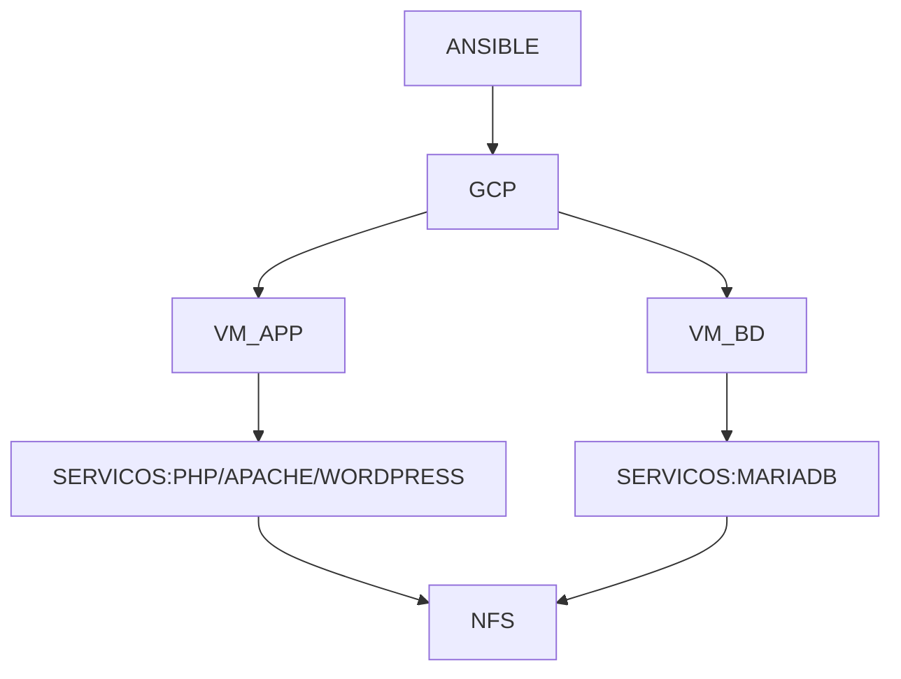

# webinar_ansible_makefile

**Coisas para instalar no pip**
- apache-libcloud
- requests
- google-auth

**Coisas para inserir no arquivo /etc/ansible**
- [inventory] enable_plugins = host_list, script, yaml, ini, gcp_compute

**Coisas para se lembrar**
- Gerenciamento de Configuração
- Idempotência
- Orquestração
- Provisionamento
- Receita (Playbook)
- Criar o nfs e alterar os apontamentos no group_vars

**O que será executado?**:
- Execução de receita (playbook) para provisionamento de infraestrutura na Google Cloud Plataform
- Execução de receita (playbook) para orquestração do servidor de aplicação
  - Instalar NFS, PHP, APACHE e WORDPRESS
- Orquestração do servidor de banco
  - Instalar NFS e MARIADB
- A receita visa a garantia de estado do ambiente

